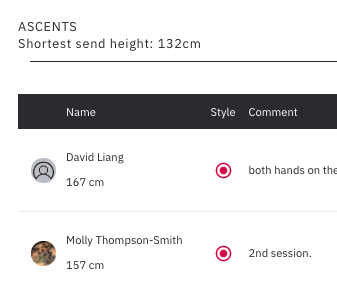
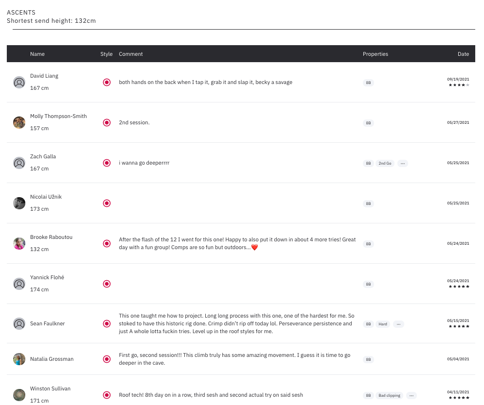
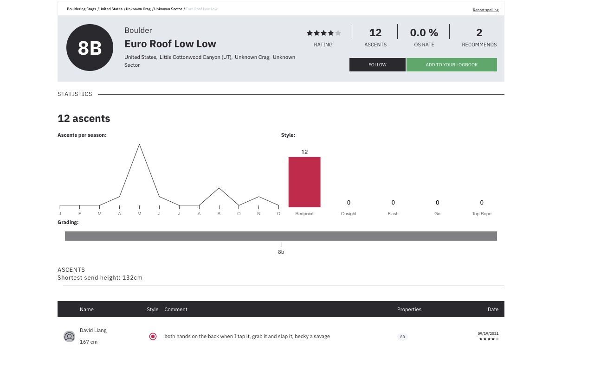

# 8a_height

See the height of people who have logged sends on 8a.nu! It's a little slow but I suck at JS.

## Sample






## How to use
Download/clone this repository. You can try something like
```
git clone git@github.com:dliangsta/8a_height.git
```

In chrome click the three dots at the top right of the window, click `More Tools`, then click `Extensions`. Click `Load unpacked` and find the folder you just cloned.

Currently working on publishing it to Chrome Web Store.
